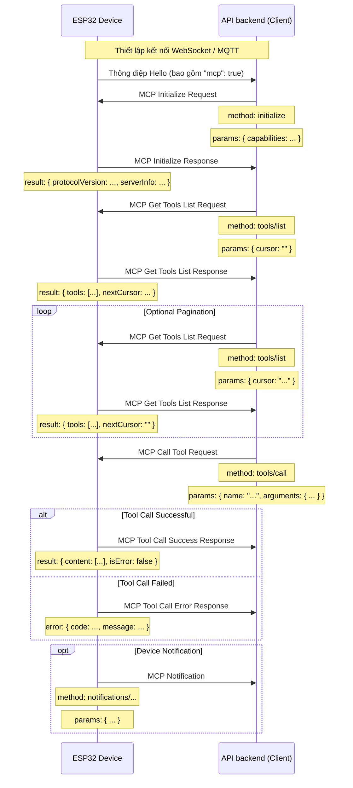

# Quy trình tương tác MCP (Model Context Protocol)

NOTICE: Tài liệu được AI hỗ trợ tạo ra. Khi triển khai dịch vụ backend, hãy đối chiếu mã nguồn để xác nhận chi tiết!!

Trong dự án này, giao thức MCP được sử dụng để kết nối API backend (khách MCP) với thiết bị ESP32 (máy chủ MCP), giúp backend phát hiện và gọi các chức năng (tool) mà thiết bị cung cấp.

## Định dạng giao thức

Theo mã nguồn (`main/protocols/protocol.cc`, `main/mcp_server.cc`), thông điệp MCP được đóng gói trong phần thân của giao thức truyền thông cơ sở (như WebSocket hoặc MQTT). Cấu trúc bên trong tuân thủ chuẩn [JSON-RPC 2.0](https://www.jsonrpc.org/specification).

Ví dụ về cấu trúc thông điệp tổng thể:

```json
{
  "session_id": "...", // ID phiên
  "type": "mcp",       // Loại thông điệp, cố định là "mcp"
  "payload": {         // Payload JSON-RPC 2.0
    "jsonrpc": "2.0",
    "method": "...",   // Tên phương thức (ví dụ: "initialize", "tools/list", "tools/call")
    "params": { ... }, // Tham số phương thức (đối với request)
    "id": ...,         // ID yêu cầu (dùng cho request và response)
    "result": { ... }, // Kết quả thực thi (đối với success response)
    "error": { ... }   // Thông tin lỗi (đối với error response)
  }
}
```

Trong đó, phần `payload` là một thông điệp JSON-RPC 2.0 tiêu chuẩn:

- `jsonrpc`: Chuỗi cố định "2.0".
- `method`: Tên phương thức cần gọi (dành cho Request).
- `params`: Tham số của phương thức, thường là một giá trị có cấu trúc (dành cho Request).
- `id`: Định danh yêu cầu; client cung cấp khi gửi request và server phản hồi nguyên dạng. Dùng để ghép cặp request/response.
- `result`: Kết quả khi phương thức chạy thành công (Success Response).
- `error`: Thông tin lỗi khi phương thức chạy thất bại (Error Response).

## Quy trình tương tác và thời điểm gửi

Các tương tác của MCP xoay quanh việc client (API backend) phát hiện và gọi các “tool” trên thiết bị.

1.  **Thiết lập kết nối và thông báo khả năng**

    - **Thời điểm:** Khi thiết bị khởi động và kết nối thành công tới API backend.
    - **Bên gửi:** Thiết bị.
    - **Thông điệp:** Thiết bị gửi thông điệp "hello" của giao thức cơ sở tới API backend, liệt kê các khả năng mà thiết bị hỗ trợ, chẳng hạn đánh dấu hỗ trợ MCP (`"mcp": true`).
    - **Ví dụ (không phải payload MCP, mà là thông điệp giao thức cơ sở):**
      ```json
      {
        "type": "hello",
        "version": ...,
        "features": {
          "mcp": true,
          ...
        },
        "transport": "websocket", // hoặc "mqtt"
        "audio_params": { ... },
        "session_id": "..." // Có thể được đặt sau khi thiết bị nhận hello từ server
      }
      ```

2.  **Khởi tạo phiên MCP**

    - **Thời điểm:** API backend nhận thông điệp "hello" từ thiết bị, xác nhận thiết bị hỗ trợ MCP và thường gửi request đầu tiên cho phiên MCP.
    - **Bên gửi:** API backend (client).
    - **Phương thức:** `initialize`
    - **Thông điệp (payload MCP):**

      ```json
      {
        "jsonrpc": "2.0",
        "method": "initialize",
        "params": {
          "capabilities": {
            // Các khả năng của client, tùy chọn

            // Khả năng xử lý hình ảnh từ camera
            "vision": {
              "url": "...", // Camera: địa chỉ xử lý ảnh (phải là HTTP, không phải WebSocket)
              "token": "..." // Token cho URL
            }

            // ... Các khả năng khác của client
          }
        },
        "id": 1 // ID yêu cầu
      }
      ```

    - **Khi nào thiết bị phản hồi:** Sau khi thiết bị nhận và xử lý request `initialize`.
    - **Thông điệp phản hồi của thiết bị (payload MCP):**
      ```json
      {
        "jsonrpc": "2.0",
        "id": 1, // Khớp với ID yêu cầu
        "result": {
          "protocolVersion": "2024-11-05",
          "capabilities": {
            "tools": {} // Trường tools ở đây không liệt kê chi tiết, cần gọi tools/list
          },
          "serverInfo": {
            "name": "...", // Tên thiết bị (BOARD_NAME)
            "version": "..." // Phiên bản firmware của thiết bị
          }
        }
      }
      ```

3.  **Lấy danh sách tool của thiết bị**

    - **Thời điểm:** API backend cần biết các chức năng (tool) mà thiết bị đang hỗ trợ và cách gọi chúng.
    - **Bên gửi:** API backend (client).
    - **Phương thức:** `tools/list`
    - **Thông điệp (payload MCP):**
      ```json
      {
        "jsonrpc": "2.0",
        "method": "tools/list",
        "params": {
          "cursor": "" // Dùng cho phân trang, lần gọi đầu tiên để chuỗi rỗng
        },
        "id": 2 // ID yêu cầu
      }
      ```
    - **Khi nào thiết bị phản hồi:** Sau khi thiết bị nhận request `tools/list` và tạo danh sách tool.
    - **Thông điệp phản hồi của thiết bị (payload MCP):**
      ```json
      {
        "jsonrpc": "2.0",
        "id": 2, // Khớp với ID yêu cầu
        "result": {
          "tools": [
            {
              "name": "self.audio_speaker.set_volume",
              "description": "...",
              "inputSchema": {
                "type": "object",
                "properties": {
                  "volume": {
                    "type": "integer",
                    "description": "...",
                    "minimum": 0,
                    "maximum": 100
                  }
                },
                "required": ["volume"]
              }
            }

            // ... Các tool khác
          ],
          "nextCursor": "..." // Nếu danh sách lớn cần phân trang, trường này chứa cursor cho lần gọi tiếp theo
        }
      }
      ```
    - **Xử lý phân trang:** Nếu trường `nextCursor` không rỗng, client cần gửi lại request `tools/list` và truyền giá trị `cursor` này trong `params` để lấy trang tiếp theo.

4.  **Gọi tool trên thiết bị**

    - **Thời điểm:** Khi API backend cần thực thi một chức năng cụ thể trên thiết bị.
    - **Bên gửi:** API backend (client).
    - **Phương thức:** `tools/call`
    - **Thông điệp (payload MCP):**
      ```json
      {
        "jsonrpc": "2.0",
        "method": "tools/call",
        "params": {
          "name": "self.audio_speaker.set_volume", // Tên tool cần gọi
          "arguments": {
            // Tham số của tool, ở dạng đối tượng
            "volume": 50 // Tên tham số và giá trị của nó
          }
        },
        "id": 3 // ID yêu cầu
      }
      ```
    - **Khi nào thiết bị phản hồi:** Sau khi thiết bị nhận `tools/call` và thực thi hàm tương ứng.
    - **Thông điệp phản hồi thành công của thiết bị (payload MCP):**
      ```json
      {
        "jsonrpc": "2.0",
        "id": 3, // Khớp với ID yêu cầu
        "result": {
          "content": [
            // Nội dung kết quả thực thi tool
            { "type": "text", "text": "true" } // Ví dụ: set_volume trả về bool
          ],
          "isError": false // Đánh dấu thành công
        }
      }
      ```
    - **Thông điệp phản hồi thất bại của thiết bị (payload MCP):**
      ```json
      {
        "jsonrpc": "2.0",
        "id": 3, // Khớp với ID yêu cầu
        "error": {
          "code": -32601, // Mã lỗi JSON-RPC, ví dụ Method not found (-32601)
          "message": "Unknown tool: self.non_existent_tool" // Mô tả lỗi
        }
      }
      ```

5.  **Thiết bị chủ động gửi thông điệp (Notification)**
    - **Thời điểm:** Khi thiết bị có sự kiện cần thông báo cho API backend (ví dụ thay đổi trạng thái; mã nguồn chưa có ví dụ rõ ràng nhưng `Application::SendMcpMessage` cho thấy thiết bị có thể chủ động gửi thông điệp MCP).
    - **Bên gửi:** Thiết bị (server).
    - **Phương thức:** Có thể bắt đầu bằng tiền tố `notifications/` hoặc một tên tùy chỉnh khác.
    - **Thông điệp (payload MCP):** Tuân theo định dạng Notification của JSON-RPC, không có trường `id`.
      ```json
      {
        "jsonrpc": "2.0",
        "method": "notifications/state_changed", // Ví dụ tên phương thức
        "params": {
          "newState": "idle",
          "oldState": "connecting"
        }
        // Không có trường id
      }
      ```
    - **Xử lý ở API backend:** Sau khi nhận Notification, backend xử lý tương ứng và không gửi phản hồi.

## Sơ đồ tương tác

Dưới đây là sơ đồ trình tự tối giản minh họa các thông điệp MCP chính:



Tài liệu này mô tả các bước tương tác chính của giao thức MCP trong dự án. Để biết chi tiết tham số và chức năng từng tool, hãy xem `main/mcp_server.cc`, hàm `McpServer::AddCommonTools` và phần triển khai của từng tool.
