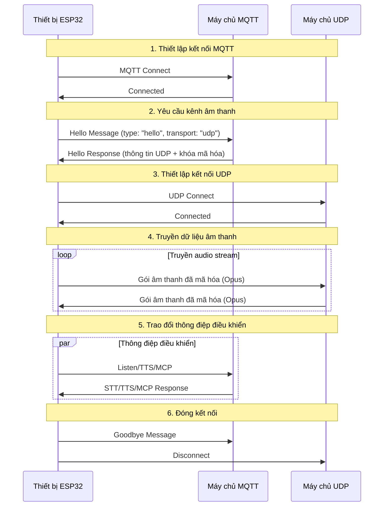
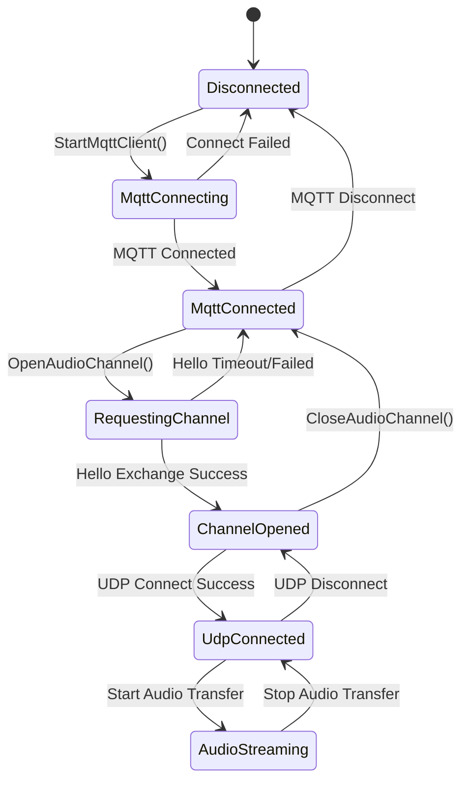

# Tài liệu giao thức truyền thông kết hợp MQTT + UDP

Tài liệu được tổng hợp từ phần hiện thực trong mã nguồn, mô tả cách thiết bị và máy chủ trao đổi: sử dụng MQTT để truyền thông điệp điều khiển và dùng UDP để truyền dữ liệu âm thanh.

---

## 1. Tổng quan giao thức

Giao thức này kết hợp hai kênh truyền:
- **MQTT**: dùng cho thông điệp điều khiển, đồng bộ trạng thái, trao đổi JSON
- **UDP**: dùng cho truyền âm thanh thời gian thực, hỗ trợ mã hóa

### 1.1 Đặc điểm

- **Thiết kế hai kênh**: tách điều khiển và dữ liệu để đảm bảo độ trễ thấp
- **Truyền mã hóa**: gói âm thanh UDP được mã hóa bằng AES-CTR
- **Bảo vệ bằng số thứ tự**: tránh phát lại và lộn xộn gói tin
- **Tự động kết nối lại**: MQTT sẽ tự khôi phục khi bị ngắt kết nối

---

## 2. Tổng quan luồng xử lý



---

## 3. Kênh điều khiển MQTT

### 3.1 Thiết lập kết nối

Thiết bị kết nối tới máy chủ MQTT với các tham số:
- **Endpoint**: địa chỉ và cổng của MQTT broker
- **Client ID**: định danh duy nhất của thiết bị
- **Username/Password**: thông tin xác thực
- **Keep Alive**: chu kỳ heartbeat (mặc định 240 giây)

### 3.2 Trao đổi thông điệp Hello

#### 3.2.1 Thiết bị gửi Hello

```json
{
  "type": "hello",
  "version": 3,
  "transport": "udp",
  "features": {
    "mcp": true
  },
  "audio_params": {
    "format": "opus",
    "sample_rate": 16000,
    "channels": 1,
    "frame_duration": 60
  }
}
```

#### 3.2.2 Máy chủ phản hồi Hello

```json
{
  "type": "hello",
  "transport": "udp",
  "session_id": "xxx",
  "audio_params": {
    "format": "opus",
    "sample_rate": 24000,
    "channels": 1,
    "frame_duration": 60
  },
  "udp": {
    "server": "192.168.1.100",
    "port": 8888,
    "key": "0123456789ABCDEF0123456789ABCDEF",
    "nonce": "0123456789ABCDEF0123456789ABCDEF"
  }
}
```

**Giải thích trường dữ liệu:**
- `udp.server`: địa chỉ máy chủ UDP
- `udp.port`: cổng máy chủ UDP
- `udp.key`: khóa AES dạng chuỗi hex
- `udp.nonce`: nonce AES dạng chuỗi hex

### 3.3 Các loại thông điệp JSON

#### 3.3.1 Thiết bị → Máy chủ

1. **Listen**
   ```json
   {
     "session_id": "xxx",
     "type": "listen",
     "state": "start",
     "mode": "manual"
   }
   ```

2. **Abort**
   ```json
   {
     "session_id": "xxx",
     "type": "abort",
     "reason": "wake_word_detected"
   }
   ```

3. **MCP**
   ```json
   {
     "session_id": "xxx",
     "type": "mcp",
     "payload": {
       "jsonrpc": "2.0",
       "id": 1,
       "result": {...}
     }
   }
   ```

4. **Goodbye**
   ```json
   {
     "session_id": "xxx",
     "type": "goodbye"
   }
   ```

#### 3.3.2 Máy chủ → Thiết bị

Các loại thông điệp giống với giao thức WebSocket:
- **STT**: kết quả nhận dạng giọng nói
- **TTS**: điều khiển phát lại giọng nói tổng hợp
- **LLM**: điều khiển biểu đạt cảm xúc
- **MCP**: điều khiển IoT thông qua MCP
- **System**: lệnh hệ thống
- **Custom**: thông điệp tùy chỉnh (tùy chọn)

---

## 4. Kênh âm thanh UDP

### 4.1 Thiết lập kết nối

Sau khi nhận phản hồi Hello, thiết bị dùng thông tin UDP kèm theo để mở kênh âm thanh:
1. Phân tích địa chỉ và cổng máy chủ UDP
2. Phân tích khóa và nonce mã hóa
3. Khởi tạo ngữ cảnh AES-CTR
4. Thiết lập kết nối UDP

### 4.2 Định dạng dữ liệu âm thanh

#### 4.2.1 Cấu trúc gói âm thanh đã mã hóa

```
|type 1byte|flags 1byte|payload_len 2bytes|ssrc 4bytes|timestamp 4bytes|sequence 4bytes|
|payload payload_len bytes|
```

**Giải thích trường:**
- `type`: loại gói, cố định 0x01
- `flags`: cờ trạng thái, hiện chưa sử dụng
- `payload_len`: độ dài payload (big-endian)
- `ssrc`: định danh nguồn đồng bộ
- `timestamp`: dấu thời gian (big-endian)
- `sequence`: số thứ tự (big-endian)
- `payload`: dữ liệu Opus đã mã hóa

#### 4.2.2 Thuật toán mã hóa

Sử dụng chế độ **AES-CTR**:
- **Khóa**: 128 bit, do máy chủ cấp
- **Nonce**: 128 bit, do máy chủ cấp
- **Bộ đếm**: kết hợp timestamp và sequence

### 4.3 Quản lý số thứ tự

- **Thiết bị gửi**: `local_sequence_` tăng đơn điệu
- **Thiết bị nhận**: `remote_sequence_` kiểm tra tính liên tục
- **Chống phát lại**: bỏ qua gói có sequence nhỏ hơn giá trị mong đợi
- **Xử lý sai lệch**: cho phép nhảy sequence nhỏ, ghi lại cảnh báo

### 4.4 Xử lý lỗi

1. **Giải mã thất bại**: ghi nhận lỗi, loại bỏ gói
2. **Sequence bất thường**: ghi cảnh báo nhưng vẫn xử lý gói
3. **Định dạng gói lỗi**: ghi lỗi, loại bỏ gói

---

## 5. Quản lý trạng thái

### 5.1 Trạng thái kết nối



### 5.2 Kiểm tra trạng thái

Thiết bị sử dụng điều kiện sau để xác định kênh âm thanh còn hợp lệ:
```cpp
bool IsAudioChannelOpened() const {
    return udp_ != nullptr && !error_occurred_ && !IsTimeout();
}
```

---

## 6. Tham số cấu hình

### 6.1 Cấu hình MQTT

Các mục đọc từ phần cài đặt:
- `endpoint`: địa chỉ máy chủ MQTT
- `client_id`: định danh client
- `username`: tên đăng nhập
- `password`: mật khẩu
- `keepalive`: chu kỳ heartbeat (mặc định 240 giây)
- `publish_topic`: topic publish

### 6.2 Tham số âm thanh

- **Định dạng**: Opus
- **Tốc độ lấy mẫu**: 16000 Hz (thiết bị) / 24000 Hz (máy chủ)
- **Số kênh**: 1 (mono)
- **Độ dài khung**: 60 ms

---

## 7. Xử lý lỗi và kết nối lại

### 7.1 Cơ chế kết nối lại MQTT

- Tự động thử lại khi kết nối thất bại
- Hỗ trợ báo cáo lỗi tùy biến
- Khi mất kết nối sẽ khởi động quy trình dọn dẹp

### 7.2 Quản lý kết nối UDP

- Không tự động thử lại khi kết nối thất bại
- Phụ thuộc kênh MQTT để đàm phán lại
- Hỗ trợ truy vấn trạng thái kết nối

### 7.3 Xử lý timeout

Lớp cơ sở `Protocol` cung cấp kiểm tra timeout:
- Timeout mặc định: 120 giây
- Dựa trên thời điểm nhận dữ liệu cuối cùng
- Khi quá hạn sẽ đánh dấu kênh không khả dụng

---

## 8. Bảo mật

### 8.1 Mã hóa đường truyền

- **MQTT**: hỗ trợ TLS/SSL (cổng 8883)
- **UDP**: sử dụng AES-CTR cho âm thanh

### 8.2 Cơ chế xác thực

- **MQTT**: xác thực bằng username/password
- **UDP**: khóa được phân phối thông qua kênh MQTT

### 8.3 Chống tấn công phát lại

- Sequence tăng đơn điệu
- Loại bỏ gói quá hạn
- Kiểm tra timestamp

---

## 9. Tối ưu hiệu năng

### 9.1 Kiểm soát song song

Dùng mutex để bảo vệ kết nối UDP:
```cpp
std::lock_guard<std::mutex> lock(channel_mutex_);
```

### 9.2 Quản lý bộ nhớ

- Tạo/hủy đối tượng mạng một cách động
- Sử dụng smart pointer cho gói âm thanh
- Giải phóng kịp thời ngữ cảnh mã hóa

### 9.3 Tối ưu mạng

- Tái sử dụng kết nối UDP
- Tối ưu kích thước gói tin
- Kiểm tra tính liên tục của sequence

---

## 10. So sánh với WebSocket

| Tính năng | MQTT + UDP | WebSocket |
|-----------|------------|-----------|
| Kênh điều khiển | MQTT | WebSocket |
| Kênh âm thanh | UDP (mã hóa) | WebSocket (nhị phân) |
| Độ trễ | Thấp (UDP) | Trung bình |
| Độ tin cậy | Trung bình | Cao |
| Độ phức tạp | Cao | Thấp |
| Mã hóa | AES-CTR | TLS |
| Tương thích tường lửa | Thấp | Cao |

---

## 11. Khuyến nghị triển khai

### 11.1 Môi trường mạng

- Đảm bảo cổng UDP thông suốt
- Thiết lập quy tắc tường lửa phù hợp
- Cân nhắc giải pháp NAT traversal

### 11.2 Cấu hình máy chủ

- Cấu hình MQTT Broker
- Triển khai máy chủ UDP
- Hệ thống quản lý khóa

### 11.3 Chỉ số giám sát

- Tỷ lệ kết nối thành công
- Độ trễ truyền âm thanh
- Tỷ lệ mất gói
- Tỷ lệ giải mã thất bại

---

## 12. Tổng kết

Giao thức kết hợp MQTT + UDP cung cấp truyền thông âm thanh hiệu quả nhờ các yếu tố:

- **Kiến trúc tách rời**: chia riêng kênh điều khiển và kênh dữ liệu
- **Bảo vệ bằng mã hóa**: AES-CTR giữ an toàn cho gói âm thanh
- **Quản lý trình tự**: tránh phát lại và lộn xộn dữ liệu
- **Tự phục hồi**: hỗ trợ tự động kết nối lại khi đứt mạch
- **Tối ưu hiệu năng**: UDP đảm bảo độ trễ thấp cho âm thanh

Giải pháp phù hợp với các kịch bản tương tác giọng nói yêu cầu độ trễ thấp, nhưng cần cân đối giữa độ phức tạp mạng và hiệu suất truyền dẫn.
