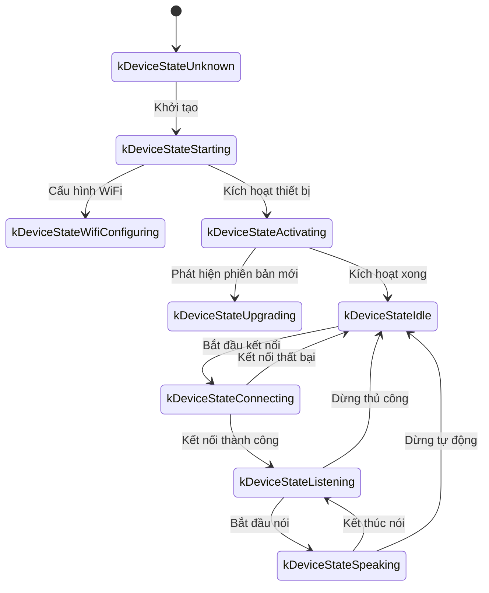
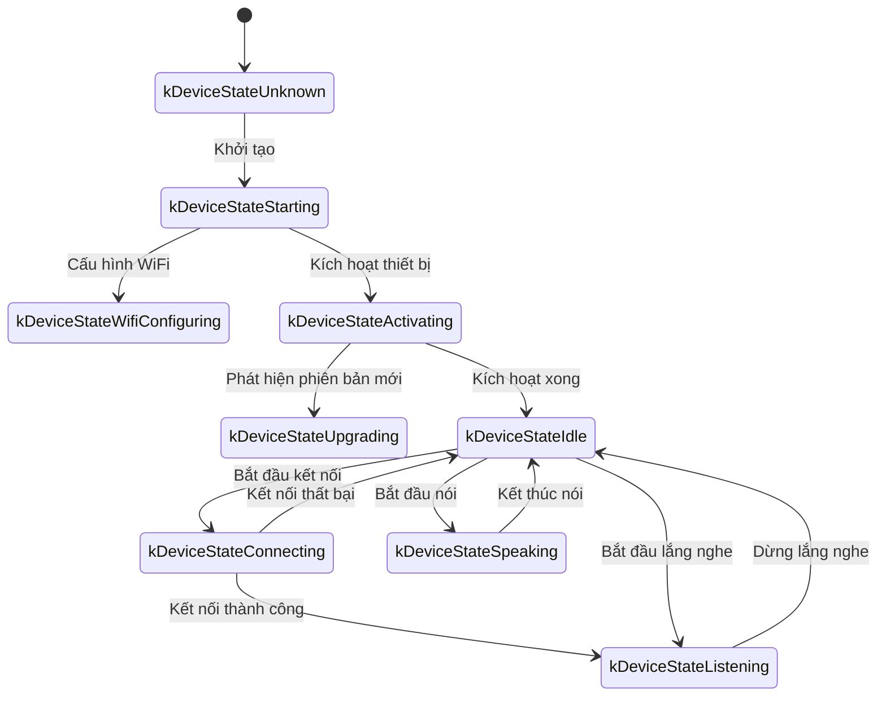

Tài liệu này được biên soạn từ mã nguồn hiện có, mô tả cách thiết bị và máy chủ trao đổi với nhau thông qua WebSocket.

Lưu ý: nội dung dựa trên việc suy luận từ phía thiết bị. Khi triển khai thực tế, cần phối hợp cùng hiện thực trên máy chủ để xác nhận hoặc bổ sung chi tiết.

---

## 1. Tổng quan quy trình

1. **Khởi tạo phía thiết bị**  
   - Thiết bị khởi động và khởi tạo `Application`:  
     - Chuẩn bị bộ mã hóa/giải mã âm thanh, màn hình, đèn LED...  
     - Kết nối mạng  
     - Tạo và khởi tạo phiên bản giao thức WebSocket (`WebsocketProtocol`) hiện thực giao diện `Protocol`  
   - Thiết bị vào vòng lặp chính, chờ các sự kiện (âm thanh vào, âm thanh ra, tác vụ điều phối...).

2. **Thiết lập kết nối WebSocket**  
   - Khi cần bắt đầu một phiên thoại (ví dụ có lệnh đánh thức, người dùng bấm nút), thiết bị gọi `OpenAudioChannel()`:
     - Lấy URL WebSocket từ cấu hình
     - Thiết lập các header (`Authorization`, `Protocol-Version`, `Device-Id`, `Client-Id`)
     - Gọi `Connect()` để tạo kết nối WebSocket với máy chủ

3. **Thiết bị gửi thông điệp "hello"**  
   - Sau khi kết nối thành công, thiết bị gửi một thông điệp JSON, ví dụ:
   ```json
   {
     "type": "hello",
     "version": 1,
     "features": {
       "mcp": true
     },
     "transport": "websocket",
     "audio_params": {
       "format": "opus",
       "sample_rate": 16000,
       "channels": 1,
       "frame_duration": 60
     }
   }
   ```
   - `features` là trường tùy chọn, được sinh theo cấu hình biên dịch. Ví dụ `"mcp": true` nghĩa là thiết bị hỗ trợ giao thức MCP.
   - `frame_duration` lấy từ hằng `OPUS_FRAME_DURATION_MS` (thường là 60ms).

4. **Máy chủ phản hồi "hello"**  
   - Thiết bị chờ thông điệp JSON từ máy chủ có `"type": "hello"` và `"transport": "websocket"`.
   - Máy chủ có thể cấp thêm `session_id`; thiết bị sẽ lưu lại khi nhận được.
   - Ví dụ:
   ```json
   {
     "type": "hello",
     "transport": "websocket",
     "session_id": "xxx",
     "audio_params": {
       "format": "opus",
       "sample_rate": 24000,
       "channels": 1,
       "frame_duration": 60
     }
   }
   ```
   - Nếu phản hồi hợp lệ, thiết bị đánh dấu kênh âm thanh đã sẵn sàng.
   - Nếu quá thời gian chờ (mặc định 10 giây) mà không nhận được phản hồi hợp lệ, việc kết nối thất bại và kích hoạt xử lý lỗi mạng.

5. **Trao đổi thông điệp tiếp theo**  
   - Thiết bị và máy chủ có hai loại dữ liệu chính:
     1. **Âm thanh nhị phân** (Opus)
     2. **Thông điệp JSON dạng văn bản** (trạng thái hội thoại, sự kiện TTS/STT, thông điệp MCP...)

   - Trong mã, dữ liệu nhận được phân loại bởi:
     - `OnData(...)`:
       - `binary = true`: xử lý như khung âm thanh Opus và giải mã.
       - `binary = false`: coi là chuỗi JSON, phân tích bằng cJSON và thực thi nghiệp vụ tương ứng (chat, TTS, MCP...).

   - Khi máy chủ hoặc mạng bị ngắt, callback `OnDisconnected()` chạy:
     - Thiết bị gọi `on_audio_channel_closed_()` và quay về trạng thái rỗi.

6. **Đóng kết nối WebSocket**  
   - Khi kết thúc phiên thoại, thiết bị gọi `CloseAudioChannel()` để chủ động ngắt kết nối và trở lại trạng thái rỗi.
   - Nếu máy chủ chủ động ngắt, quy trình callback tương tự sẽ diễn ra.

---

## 2. Các header chung

Trong quá trình handshake, thiết bị thiết lập các header sau:

- `Authorization`: chứa token truy cập, dạng `"Bearer <token>"`  
- `Protocol-Version`: phiên bản giao thức, trùng với trường `version` trong thông điệp hello  
- `Device-Id`: địa chỉ MAC của thiết bị  
- `Client-Id`: UUID sinh bởi phần mềm (sẽ đổi khi xóa NVS hoặc flash toàn bộ firmware)

Các header này được gửi cùng với yêu cầu kết nối, giúp máy chủ xác thực và định danh thiết bị.

---

## 3. Các phiên bản giao thức nhị phân

Thiết bị hỗ trợ nhiều phiên bản giao thức nhị phân được chọn qua trường `version` trong cấu hình:

### 3.1 Phiên bản 1 (mặc định)
Gửi trực tiếp dữ liệu Opus, không kèm metadata. WebSocket phân biệt text/binary.

### 3.2 Phiên bản 2
Sử dụng cấu trúc `BinaryProtocol2`:
```c
struct BinaryProtocol2 {
    uint16_t version;        // Phiên bản giao thức
    uint16_t type;           // Loại thông điệp (0: OPUS, 1: JSON)
    uint32_t reserved;       // Dành riêng
    uint32_t timestamp;      // Dấu thời gian (ms, phục vụ AEC phía server)
    uint32_t payload_size;   // Kích thước payload (byte)
    uint8_t payload[];       // Dữ liệu payload
} __attribute__((packed));
```

### 3.3 Phiên bản 3
Sử dụng `BinaryProtocol3`:
```c
struct BinaryProtocol3 {
    uint8_t type;            // Loại thông điệp
    uint8_t reserved;        // Dành riêng
    uint16_t payload_size;   // Kích thước payload
    uint8_t payload[];       // Dữ liệu payload
} __attribute__((packed));
```

---

## 4. Cấu trúc thông điệp JSON

Thông điệp text trên WebSocket sử dụng JSON. Các mục dưới đây liệt kê giá trị `"type"` phổ biến và cách xử lý.

### 4.1 Thiết bị → Máy chủ

1. **Hello**  
   - Gửi sau khi kết nối để thông báo thông tin cơ bản.  
   - Ví dụ giống với phần trên.

2. **Listen**  
   - Điều khiển trạng thái ghi âm.  
   - Các trường phổ biến:
     - `"session_id"`: mã phiên
     - `"type": "listen"`
     - `"state"`: `"start"`, `"stop"`, `"detect"` (đã phát hiện từ khóa)
     - `"mode"`: `"auto"`, `"manual"` hoặc `"realtime"`
   - Ví dụ bắt đầu lắng nghe:
     ```json
     {
       "session_id": "xxx",
       "type": "listen",
       "state": "start",
       "mode": "manual"
     }
     ```

3. **Abort**  
   - Kết thúc việc nói hoặc phiên âm thanh hiện tại.
   - Ví dụ:
     ```json
     {
       "session_id": "xxx",
       "type": "abort",
       "reason": "wake_word_detected"
     }
     ```
   - `reason` có thể là `"wake_word_detected"` hoặc giá trị khác theo nhu cầu.

4. **Wake Word Detected**  
   - Báo cho máy chủ biết đã phát hiện từ khóa kích hoạt.
   - Có thể gửi kèm một đoạn audio Opus trước đó để server xác thực giọng.
   - Ví dụ:
     ```json
     {
       "session_id": "xxx",
       "type": "listen",
       "state": "detect",
       "text": "Xin chào Tiểu Minh"
     }
     ```

5. **MCP**  
   - Giao thức khuyến nghị cho điều khiển IoT. Thông điệp có `"type": "mcp"` và `payload` tuân thủ JSON-RPC 2.0 (xem thêm [mcp-protocol.md](./mcp-protocol.md)).
   - Ví dụ thiết bị trả về kết quả:
     ```json
     {
       "session_id": "xxx",
       "type": "mcp",
       "payload": {
         "jsonrpc": "2.0",
         "id": 1,
         "result": {
           "content": [
             { "type": "text", "text": "true" }
           ],
           "isError": false
         }
       }
     }
     ```

---

### 4.2 Máy chủ → Thiết bị

1. **Hello**  
   - Xác nhận handshake.  
   - Phải có `"type": "hello"` và `"transport": "websocket"`.  
   - Có thể kèm `audio_params` hoặc `session_id`.

2. **STT**  
   - Ví dụ: `{"session_id": "xxx", "type": "stt", "text": "..."}`  
   - Thể hiện kết quả nhận dạng giọng nói; thiết bị có thể hiển thị hoặc dùng cho logic tiếp theo.

3. **LLM**  
   - Ví dụ: `{"session_id": "xxx", "type": "llm", "emotion": "happy", "text": "😀"}`  
   - Máy chủ yêu cầu thiết bị thể hiện cảm xúc/hiệu ứng hình ảnh tương ứng.

4. **TTS**  
   - `{"session_id": "xxx", "type": "tts", "state": "start"}`: chuẩn bị phát âm thanh tổng hợp, thiết bị chuyển sang trạng thái đang nói.  
   - `{"session_id": "xxx", "type": "tts", "state": "stop"}`: kết thúc phát.  
   - `{"session_id": "xxx", "type": "tts", "state": "sentence_start", "text": "..."}`: hiển thị câu đang phát.

5. **MCP**  
   - Máy chủ dùng `"type": "mcp"` để gửi lệnh điều khiển IoT. Payload giữ nguyên định dạng JSON-RPC 2.0.
   - Ví dụ máy chủ gọi tool:
     ```json
     {
       "session_id": "xxx",
       "type": "mcp",
       "payload": {
         "jsonrpc": "2.0",
         "method": "tools/call",
         "params": {
           "name": "self.light.set_rgb",
           "arguments": { "r": 255, "g": 0, "b": 0 }
         },
         "id": 1
       }
     }
     ```

6. **System**  
   - Lệnh hệ thống, ví dụ:
     ```json
     {
       "session_id": "xxx",
       "type": "system",
       "command": "reboot"
     }
     ```
   - Lệnh hỗ trợ: `"reboot"` (khởi động lại thiết bị).

7. **Custom** (tùy chọn)  
   - Cần bật `CONFIG_RECEIVE_CUSTOM_MESSAGE`.  
   - Ví dụ:
     ```json
     {
       "session_id": "xxx",
       "type": "custom",
       "payload": {
         "message": "Nội dung tùy chỉnh"
       }
     }
     ```

8. **Khung âm thanh nhị phân**  
   - Máy chủ gửi gói Opus nhị phân; thiết bị giải mã và phát.  
   - Nếu thiết bị đang ở trạng thái lắng nghe, các gói này có thể bị bỏ qua để tránh xung đột.

---

## 5. Mã hóa và giải mã âm thanh

1. **Thiết bị gửi dữ liệu ghi âm**  
   - Âm thanh qua xử lý (AEC, giảm nhiễu, AGC...) được mã hóa Opus và gửi thành khung nhị phân.  
   - Tùy phiên bản giao thức nhị phân, có thể đính kèm metadata (phiên bản 2/3).

2. **Thiết bị phát âm thanh nhận được**  
   - Nhận khung nhị phân được coi là dữ liệu Opus.  
  - Thiết bị giải mã rồi chuyển cho phần cứng phát.  
   - Nếu tần số lấy mẫu khác nhau, sẽ thực hiện resample sau giải mã.

---

## 6. Dòng trạng thái phổ biến

1. **Idle → Connecting**  
   - Người dùng kích hoạt, thiết bị gọi `OpenAudioChannel()` → thiết lập WebSocket → gửi `"hello"`.

2. **Connecting → Listening**  
   - Kết nối thành công và gọi `SendStartListening(...)` → vào trạng thái ghi âm; thiết bị gửi dữ liệu microphone liên tục.

3. **Listening → Speaking**  
   - Nhận `{"type":"tts","state":"start"}` → dừng ghi âm và phát âm thanh từ máy chủ.

4. **Speaking → Idle**  
   - Nhận `{"type":"tts","state":"stop"}` → kết thúc phát. Nếu không bật tự động tiếp tục, quay lại Idle; nếu có chế độ vòng lặp, quay lại Listening.

5. **Listening/Speaking → Idle (khi lỗi hoặc hủy)**  
   - Gọi `SendAbortSpeaking(...)` hoặc `CloseAudioChannel()` → hủy phiên → đóng WebSocket → trở về Idle.

### Sơ đồ trạng thái chế độ tự động



### Sơ đồ trạng thái chế độ thủ công



---

## 7. Xử lý lỗi

1. **Kết nối thất bại**  
   - Nếu `Connect(url)` trả về lỗi hoặc không nhận được "hello" từ máy chủ đúng hạn, callback `on_network_error_()` chạy. Thiết bị có thể cảnh báo “không thể kết nối tới dịch vụ”.

2. **Máy chủ ngắt kết nối**  
   - Nếu WebSocket bị cắt đột ngột, `OnDisconnected()` sẽ:
     - Gọi `on_audio_channel_closed_()`
     - Đưa trạng thái về Idle hoặc kích hoạt logic thử lại

---

## 8. Lưu ý khác

1. **Xác thực**  
   - Thiết bị gửi token qua header `Authorization: Bearer <token>`. Máy chủ cần kiểm tra tính hợp lệ.  
   - Nếu token hết hạn/không hợp lệ, máy chủ có thể từ chối handshake hoặc ngắt sau đó.

2. **Quản lý phiên**  
   - Nhiều thông điệp chứa `session_id` để phân tách hội thoại. Máy chủ dùng giá trị này để xử lý độc lập từng phiên.

3. **Âm thanh**  
   - Mặc định sử dụng Opus, `sample_rate = 16000`, mono. `OPUS_FRAME_DURATION_MS` quyết định chiều dài khung (thường 60ms). Máy chủ có thể phát trả 24000 Hz để có chất lượng tốt hơn.

4. **Cấu hình phiên bản giao thức**  
   - Trường `version` chọn giữa giao thức nhị phân 1/2/3.
   - Phiên bản 1: gửi thẳng Opus.
   - Phiên bản 2: có timestamp, phù hợp với AEC trên máy chủ.
   - Phiên bản 3: phiên bản rút gọn.

5. **Khuyến nghị dùng MCP cho IoT**  
   - Toàn bộ việc khám phá khả năng, đồng bộ trạng thái, gửi lệnh IoT nên dùng `"type": "mcp"`. Cách cũ `"type": "iot"` đã bỏ.  
   - MCP hoạt động trên WebSocket, MQTT và các kênh khác với tính chuẩn hóa và mở rộng tốt.
   - Tham khảo [mcp-protocol.md](./mcp-protocol.md) và [mcp-usage.md](./mcp-usage.md) để biết chi tiết.

6. **Thông điệp JSON lỗi**  
   - Nếu thiếu trường bắt buộc (ví dụ không có `"type"`), thiết bị ghi log lỗi (`ESP_LOGE`) và không xử lý nghiệp vụ.

---

## 9. Ví dụ luồng thông điệp

Ví dụ rút gọn về luồng trao đổi hai chiều:

1. **Thiết bị → Máy chủ** (handshake)
   ```json
   {
     "type": "hello",
     "version": 1,
     "features": {
       "mcp": true
     },
     "transport": "websocket",
     "audio_params": {
       "format": "opus",
       "sample_rate": 16000,
       "channels": 1,
       "frame_duration": 60
     }
   }
   ```

2. **Máy chủ → Thiết bị** (trả lời handshake)
   ```json
   {
     "type": "hello",
     "transport": "websocket",
     "session_id": "xxx",
     "audio_params": {
       "format": "opus",
       "sample_rate": 16000
     }
   }
   ```

3. **Thiết bị → Máy chủ** (bắt đầu lắng nghe)
   ```json
   {
     "session_id": "xxx",
     "type": "listen",
     "state": "start",
     "mode": "auto"
   }
   ```
   Đồng thời thiết bị gửi các khung nhị phân (Opus).

4. **Máy chủ → Thiết bị** (kết quả ASR)
   ```json
   {
     "session_id": "xxx",
     "type": "stt",
     "text": "Câu người dùng nói"
   }
   ```

5. **Máy chủ → Thiết bị** (bắt đầu TTS)
   ```json
   {
     "session_id": "xxx",
     "type": "tts",
     "state": "start"
   }
   ```
   Sau đó máy chủ gửi các khung âm thanh nhị phân để thiết bị phát.

6. **Máy chủ → Thiết bị** (kết thúc TTS)
   ```json
   {
     "session_id": "xxx",
     "type": "tts",
     "state": "stop"
   }
   ```
   Thiết bị dừng phát; nếu không có yêu cầu mới sẽ quay lại Idle.

---

## 10. Tổng kết

Giao thức WebSocket trong dự án cung cấp việc truyền JSON và khung âm thanh Opus để thực hiện:

- Tải lên luồng âm thanh microphone, phát lại TTS
- Quản lý trạng thái hội thoại và nhận dạng giọng nói
- Nhận và thực thi lệnh MCP

Trình tự chính:

- **Bắt tay**: gửi `"type":"hello"` và chờ phản hồi.
- **Kênh âm thanh**: truyền Opus hai chiều, hỗ trợ nhiều phiên bản giao thức nhị phân.
- **Thông điệp JSON**: phân nhánh theo `"type"` cho TTS, STT, MCP, WakeWord, System, Custom...
- **Khả năng mở rộng**: có thể bổ sung trường JSON hoặc header để đáp ứng nhu cầu xác thực và điều khiển.

Để giao tiếp suôn sẻ, thiết bị và máy chủ cần thống nhất trước về ý nghĩa trường dữ liệu, thứ tự thông điệp và cách xử lý lỗi. Tài liệu này đóng vai trò nền tảng cho công việc tích hợp và phát triển tiếp theo.
